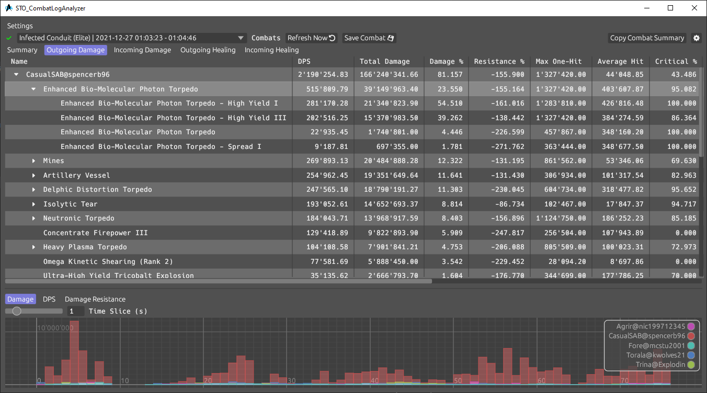

# STO_CombatLogAnalyzer (short CLA)
Tool to parse and analyze the combat log file from Star Trek Online.

It displays the result of this analysis in convenient tables and also provides multiple diagrams.
| Combat Summary                         | Outgoing Damage                       |
| -------------------------------------- | ------------------------------------- |
|  |  |

---
## Getting started
1. Download the application from the Releases page.

2. Make sure you turned off log rotation (see https://www.sto-league.com/how-to-disable-automatically-rotated-log-files/).

3. Go into the game and type "/Combatlog 1" into the chat window.
   
4. Fight something.

5. Start STO_CombatLogAnalyzer, open the Settings and enter the path to the combatlog file of the game located at "\<path to STO installation\>\Star Trek Online\Live\logs\GameClient\combatlog.log."
Click Ok at the bottom of the settings window.

6. Click the refresh button.

---
## Advanced Features
This paragraph describes the more advanced and less intuitive parts of the analyzer. The described features can be found in the Settings in the Analysis tab.

### Indirect Source Grouping Reversal Rules
Indirect sources are damage or heal sources that do not come directly from an entity but still belong to this entity. These indirect sources can for instance be pets, most anomalies and more.

Indirect sources show up in the damage or heal tables as rows that can be expanded, where the sub-rows show the actual effects that made damage or healed.

Sometimes it is more desirable to have the effect as row that can be expanded with the indirect sources as the sub-rows. This is where Indirect Source Grouping rules come into play.

Lets see this with at the example of the Tachyon Net Drones Console Ability. The effect of this console shows up as many different rows in the damage table by default. But with a Indirect Source Reversal Rule it becomes one single row in the table with the indirect sources as a sub-row.


The default settings also come with an example for the starship trait Spore-Infused Anomalies, which you can simple activate by ticking the "on" checkbox.

### Custom Grouping Rules
Custom grouping rules allows you to group multiple effects into a single row in the damage or heal tables.

Here is an example of grouping up all effects of the Advanced Piezo Beam Array, which has the neat extra effect of the Technical Overload when used with Beam Overload or Surgical Strikes.


The default settings also come with an example for the Dark Matter Quantum Torpedo, which you can simple activate by ticking the "on" checkbox.

---
## Building the tool from Source
Install the rust tool chain from https://www.rust-lang.org/.

And the build it with

```
C:\path\to\STO_CombatLogAnalyzer> cargo build --release
```

And that is it.

